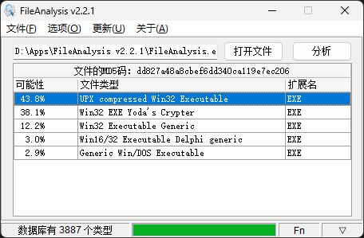

# FileAnalysis
这是一个基于TrID项目的GUI开源程序。它可以将文件的真实扩展名分析出来（即使扩展名被修改过），或者找到该文件能打开的程序。对于做逆向工程有很大的帮助。此外，还加入了文件的MD5计算，也是适合普通用户的一个实用工具。

### 闲谈
FileAnalysis是我在2008年写的一个文件类型分析工具，那个时候我还在读大学。直到2009年发布了2.2版本后就没再更新过（主要是没什么可更新的）。

每当我在做些逆向工程的时候总会用到它。以前的版本虽然也能用，但已经不适应现代的操作系统了。所以我决定把这个工具重写并且开源。

因为要开源，所以就没有使用第三方的控件。在使用内置控件的同时尽可能的做到UI美观。

看了下2009年的TodoList，其中一项是给FileAnalysis增加查看图片Exif信息。这个功能目前尚未实现，等以后有时间再说吧。你也可以自己编写代码，只要遵循GPL协议就行了。因为TrID免费版不允许商用，所以FileAnalysis使用了GPL协议。

### 关于3.0
3.0版本几乎重写了所有代码，仅参考了部分代码。所以还是花了我几天的时间，不过总算是比较让我满意。该有的功能都有，相较于之前的版本，去掉了不需要的东西。使工具更简单、更纯粹。在线更新使用了Githb的API，即使再过15年有新的版本依然可以检测到。

### 编译环境
使用Delphi 12进行开发和编译，其它版本未测试。

### TrID
TrID使用一种数据库驱动的方法，通过文件的特征和标识符来确定文件类型。如果你对该项目感兴趣可以加入它，为TrID贡献一些文件定义（defs）。[TrID官网](https://mark0.net)
